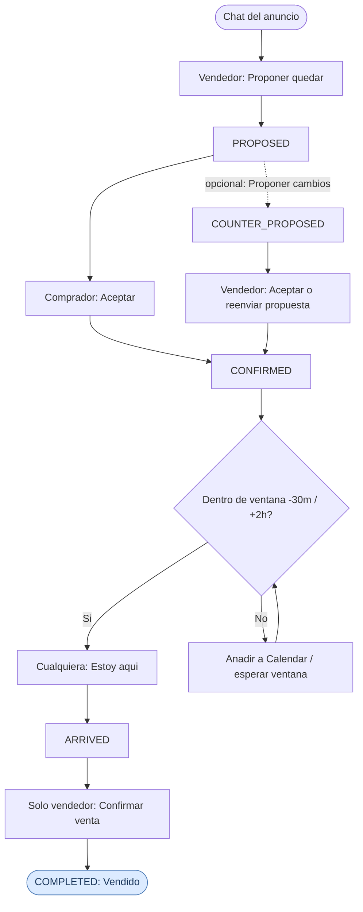
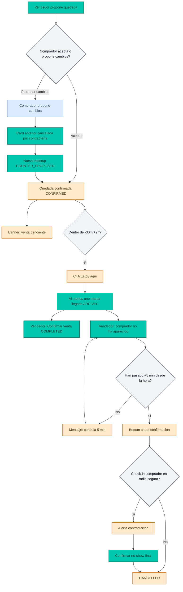

# Flujo de usuario Wallapop Meet (Mermaid)

Este documento fija el user flow oficial de Wallapop Meet para consulta rapida de producto, diseno y desarrollo.

## Happy path (referencia)

Secuencia cerrada: propuesta aceptada, llegada dentro de ventana, cierre de venta por el vendedor.

Reglas clave del happy path:

- `ACCEPT` desde `PROPOSED` solo con rol comprador; desde `COUNTER_PROPOSED`, solo el vendedor acepta la contraoferta.
- `MARK_ARRIVED` habilitado en ventana `scheduledAt - 30 min` hasta `scheduledAt + 2 h`.
- `COMPLETE` solo desde `ARRIVED` y solo con rol vendedor.

## Diagrama historico (no-show y ramas)

Flujo alternativo con reporte de no-show del vendedor (fuera del happy path basico).

