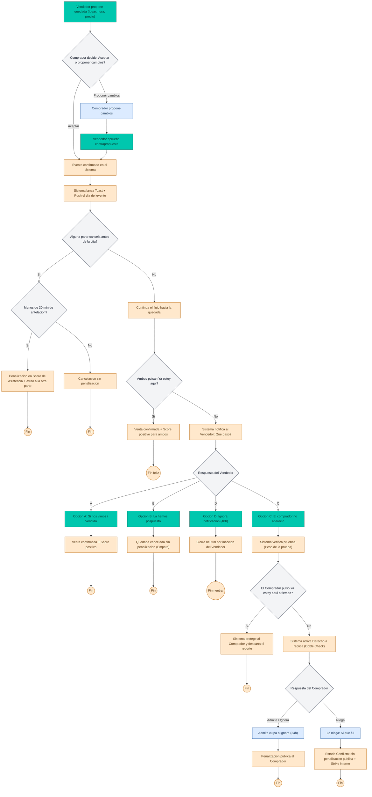

# Flujo de usuario Wallapop Meet (Mermaid)

Este documento fija el user flow oficial de Wallapop Meet para consulta rapida de producto, diseno y desarrollo.

## Diagrama

```mermaid
graph TD
V1["Vendedor propone quedada (lugar, hora, precio)"]
D1{"Comprador decide: Aceptar o proponer cambios?"}
C1["Comprador propone cambios"]
V2["Vendedor aprueba contrapropuesta"]
S1["Evento confirmado en el sistema"]

V1 --> D1
D1 -->|Aceptar| S1
D1 -->|Proponer cambios| C1 --> V2 --> S1

S2["Sistema lanza Toast + Push el dia del evento"]
D2{"Alguna parte cancela antes de la cita?"}
D3{"Menos de 30 min de antelacion?"}
S3["Penalizacion en Score de Asistencia + aviso a la otra parte"]
S4["Cancelacion sin penalizacion"]
S5["Continua el flujo hacia la quedada"]
F1((Fin))
F2((Fin))

S1 --> S2 --> D2
D2 -->|Si| D3
D3 -->|Si| S3 --> F1
D3 -->|No| S4 --> F2
D2 -->|No| S5

D4{"Ambos pulsan Ya estoy aqui?"}
S6["Venta confirmada + Score positivo para ambos"]
F3((Fin feliz))

S7["Sistema notifica al Vendedor: Que paso?"]
D5{"Respuesta del Vendedor"}
A["Opcion A: Si nos vimos / Vendido"]
B["Opcion B: La hemos pospuesto"]
C["Opcion C: El comprador no aparecio"]
DOpt["Opcion D: Ignora notificacion (48h)"]

S8["Venta confirmada + Score positivo"]
S9["Quedada cancelada sin penalizacion (Empate)"]
S10["Sistema verifica pruebas (Peso de la prueba)"]
S15["Cierre neutral por inaccion del Vendedor"]
F4((Fin))
F5((Fin))
F9((Fin neutral))

S5 --> D4
D4 -->|Si| S6 --> F3
D4 -->|No| S7 --> D5
D5 -->|A| A --> S8 --> F4
D5 -->|B| B --> S9 --> F5
D5 -->|C| C --> S10
D5 -->|D| DOpt --> S15 --> F9

D6{"El Comprador pulso Ya estoy aqui a tiempo?"}
S11["Sistema protege al Comprador y descarta el reporte"]
F6((Fin))

S12["Sistema activa Derecho a replica (Doble Check)"]
D7{"Respuesta del Comprador"}
C2["Admite culpa o ignora (24h)"]
C3["Lo niega: Si que fui"]
S13["Penalizacion publica al Comprador"]
S14["Estado Conflicto: sin penalizacion publica + Strike interno"]
F7((Fin))
F8((Fin))

S10 --> D6
D6 -->|Si| S11 --> F6
D6 -->|No| S12 --> D7
D7 -->|Admite / Ignora| C2 --> S13 --> F7
D7 -->|Niega| C3 --> S14 --> F8

classDef vendedor fill:#00C7AE,stroke:#0B6B5E,color:#073B35,stroke-width:1.5px;
classDef comprador fill:#DCEBFF,stroke:#4F7DB8,color:#1E3A5F,stroke-width:1.5px;
classDef sistema fill:#FFE8CC,stroke:#C77D2B,color:#5C3A16,stroke-width:1.5px;
classDef decision fill:#F3F4F6,stroke:#6B7280,color:#111827,stroke-width:1.5px;

class V1,V2,A,B,C,DOpt vendedor;
class C1,C2,C3 comprador;
class S1,S2,S3,S4,S5,S6,S7,S8,S9,S10,S11,S12,S13,S14,S15,F1,F2,F3,F4,F5,F6,F7,F8,F9 sistema;
class D1,D2,D3,D4,D5,D6,D7 decision;
```
